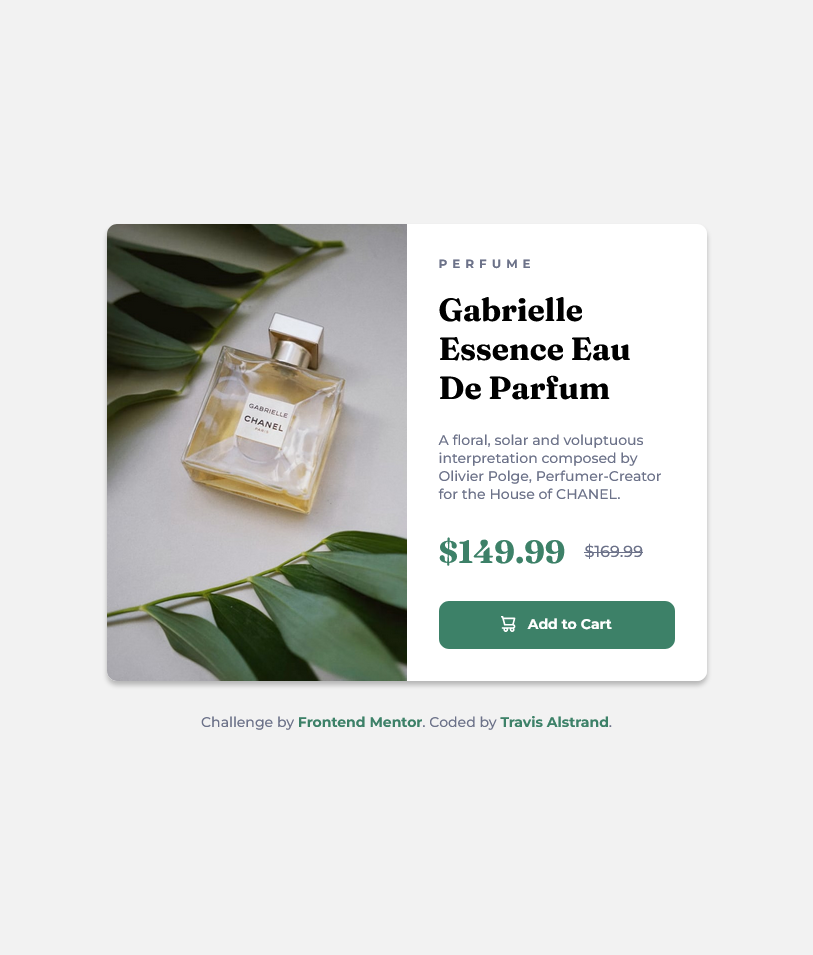

# Frontend Mentor - Product preview card component solution

This is a solution to the [Product preview card component challenge on Frontend Mentor](https://www.frontendmentor.io/challenges/product-preview-card-component-GO7UmttRfa). Frontend Mentor challenges help you improve your coding skills by building realistic projects. 

## Table of contents

- [Overview](#overview)
  - [The challenge](#the-challenge)
  - [Screenshot](#screenshot)
  - [Links](#links)
- [My process](#my-process)
  - [Built with](#built-with)
  - [What I learned](#what-i-learned)
- [Author](#author)

## Overview

A simple layout of a mock product using only HTML and CSS. Slight design changes from a mobile-view and a desktop-view.

### The challenge

Users should be able to:

- View the optimal layout depending on their device's screen size
- See hover and focus states for interactive elements

### Screenshot

### Links

- Solution URL: [https://www.frontendmentor.io/solutions/product-preview-card-component-KllC1iamDW](#)
- Live Site URL: [https://travisalstrand.github.io/FEM-product-preview-card-component/](#)

## My process

I took a mobile-first approach with the design and used a 648px screen-width media query for the main design change. 648px allowed me to keep the desired margin on the side of the card before applying `margin-inline: auto;`. 

### Built with

- Semantic HTML5 markup
- CSS custom properties
- Flexbox
- Mobile-first workflow

### What I learned

I learned about CSS `content` to change the url of the image element upon hitting the breakpoint. Struggled to figure out why the width / height were then ignored and realized I had to specify it's display before using that feature. 

## Author

- Frontend Mentor - [@Travis Alstrand](https://www.frontendmentor.io/profile/TravisAlstrand)
